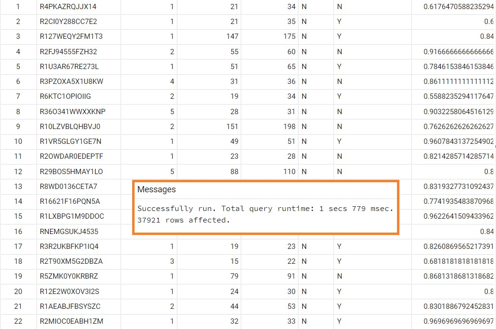
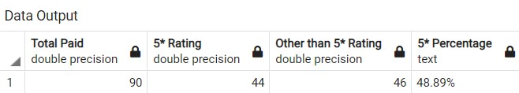
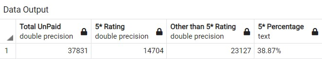
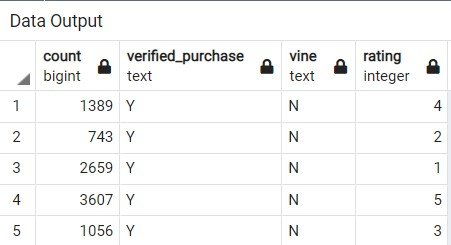
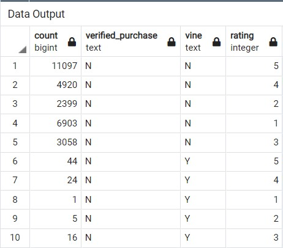

# Amazon_Vine_Analysis

## Overiew
A client Sellby is going to launch large variety of products on their leading website. They want to know reviews of their products compared to reviews of competitor products. They also want to figure out if giving a free product to best reviews is worth. 

SellBy Client is very much interested in utilizing the power of Big Data. Hence we would see how that helps in here.

### **Big Data Architecture and Data Flow **


<p align="center"> </p>

## Amazon Vine Program
The Amazon Vine program is a service that allows manufacturers and publishers to receive reviews for their products. Companies like SellBy pay a small fee to Amazon and provide products to Amazon Vine members, who are then required to publish a review.
In this project, we have access to approximately 50 datasets. Each one contains reviews of a specific product, from clothing apparel to wireless products.
The one here we analyze is about the Video Games data.

## Results
The total number of reviews was determined by first eliminating the records with votes > 20 and then filtered to reflect those that received 50% or more “helpful” votes.
```SQL

--Create a table to store Vine total votes above 20 votes
DROP TABLE IF EXISTS Vine_total_votes_above20;
SELECT * INTO Vine_total_votes_above20
FROM vine_table
WHERE total_votes > 20;
--select * from Vine_total_votes_above20 [To check votes above 20]

--Create a table to store Vine above 50 Percent votes
-- helpful_Votes/ Total_votes
DROP TABLE IF EXISTS Vine_Above50_percent;
SELECT *,
	CAST(helpful_votes AS FLOAT)/CAST(total_votes AS FLOAT) AS Above50_percent INTO Vine_Above50_percent
FROM Vine_total_votes_above20
WHERE CAST(helpful_votes AS FLOAT)/CAST(total_votes AS FLOAT) >=0.5;
--Select * from Vine_Above50_percent [ to check the Vine data for 50 percent and above votes]  
```
<p align="center"> </p>

**1) How many Vine reviews and non-Vine reviews were there?**  

 - Out of **37921** filtered records : Vine Reviews (AKA Paid reviews) are **90** AND Non-Vine Reviews (AKA Unpaid Reviews) are **37831**

**2) How many Vine reviews were 5 stars? How many non-Vine reviews were 5 stars?**  

 - Out of total 5-star ratings **14788** Vine Reviews with 5-star rating is **44** and Non-Vine Reviews with 5-star rating are **14744**

**3) What percentage of Vine reviews were 5 stars? What percentage of non-Vine reviews were 5 stars?**  

 Percentage of Vine 5-star(paid) Reviews        - **48.89%**  
 Percentage of Non Vine 5-star(Unpaid) Reviews - **38.87%**  
 *---------------------------------------------------------*  
 Total Percentage of 5-star Reviews             - **87.76%**  
 Total Non 5-start Reviews		        - **12.24%**  


Code for all the above 3 questions
**VINE PAID DATA** 
```SQL
--Calculation for Paid Votes  
--Vine Paid votes with 5 star ratings
DROP TABLE IF EXISTS Vine_paid_5star;
SELECT
    (SELECT cast(count(*) AS float)
     FROM Vine_Above50_percent
     WHERE vine = 'Y') AS total_Paid,

    (SELECT cast(count(*) AS float)
     FROM Vine_Above50_percent
     WHERE vine = 'Y'
       AND star_rating = 5) AS "5_star_rating",
     
	 (SELECT cast(count(*) AS float)
     FROM Vine_Above50_percent
     WHERE vine = 'Y'
       AND star_rating <> 5) AS "Non_5_star_rating",
	   
	 NULL AS "5_star_percentage" 
	 INTO Vine_paid_5star;
--Select * from Vine_paid_5star	[Calculate for the Paid 5 star vote data]	
		
--Updating percentage column in the Vine_Paid_5Star .
UPDATE Vine_paid_5star
SET "5_star_percentage" = CONCAT (
				cast(
				    round(
					CAST (("5_star_rating"/total_Paid) * 100 AS Numeric(5, 2))
					 , 2) 
				   AS varchar(10000))
				,'%');

--Select all values for Paid votes
SELECT total_paid as "Total Paid",
       "5_star_rating" as "5* Rating",
	   "Non_5_star_rating" as "Other than 5* Rating",
	   "5_star_percentage" as "5* Percentage"
FROM Vine_paid_5star;

```
<p align="center"> </p>


**VINE UNPAID DATA** 

```SQL
--Calculation for UnPaid Votes  
--Vine UnPaid votes with 5 star ratings
DROP TABLE IF EXISTS Vine_unpaid_5star;
SELECT
  (SELECT cast(count(*) AS float)
   FROM Vine_Above50_percent
   WHERE vine = 'N') AS total_unPaid,

  (SELECT cast(count(*) AS float)
   FROM Vine_Above50_percent
   WHERE vine = 'N'
     AND star_rating = 5) AS "5_star_rating",
   
   (SELECT cast(count(*) AS float)
     FROM Vine_Above50_percent
     WHERE vine = 'N'
       AND star_rating <> 5) AS "Non_5_star_rating",
	   
   NULL AS "5_star_percentage" INTO Vine_unpaid_5star;
   
--Updating percentage column in the Vine_UnPaid_5Star .   
UPDATE Vine_unpaid_5star
SET "5_star_percentage" = CONCAT (
				cast(
				    round(
					CAST (("5_star_rating"/total_unPaid) * 100 AS Numeric(5, 2))
					, 2) 
				     AS varchar(10000))
				,'%');
								
--Select all values for UnPaid votes							
SELECT total_unpaid as "Total UnPaid",
       "5_star_rating" as "5* Rating",
	   "Non_5_star_rating" as "Other than 5* Rating",
	   "5_star_percentage" as "5* Percentage"
FROM Vine_unpaid_5star;
```
<p align="center"></p>

*Note - The above SQL code could have been be written using more complex subqueries and single table, but that will take longer execution time and readability will reduce.

## Summary

<p align="center"></p>
<p align="center"></p>

### Conclusion
- IF we see comparison of Paid and Unpaid Reviews, the Paid reviews are way more less compared to unpaid one. This clearly shows its a bias data.

- Among the Paid review **48.89%** were 5-star which makes it can be considered as positively biased rating when compared to the Unpaid ones which is **38.87%** 

- However, the ratio of Paid : Unpaid is 0.237 which is very less. Hence the data is clearly called as biased.

- Other Information we could find is Verfied users impact on the paid and non paid reviews 
<p align="center"></p>
<p align="center"></p>
 
 As its observed in above images all Paid reviews are given by NON Verified users. That quite makes it a bit biased rating.

## Resources
### Data Source

[Amazon Reivew for Video Games](https://s3.amazonaws.com/amazon-reviews-pds/tsv/amazon_reviews_us_Video_Games_v1_00.tsv.gz)

### Software & related code files:

**Google Colab** [Amazon_Reviews_ETL.ipynb](Amazon_Reviews_ETL.ipynb)
**PgAdmin**
  - [challenge_schema.sql](Queries/challenge_schema.sql)
  - [Vine_Review_Analysis.sql](Queries/Vine_Review_Analysis.sql)

**Languages:**
  pySpark
